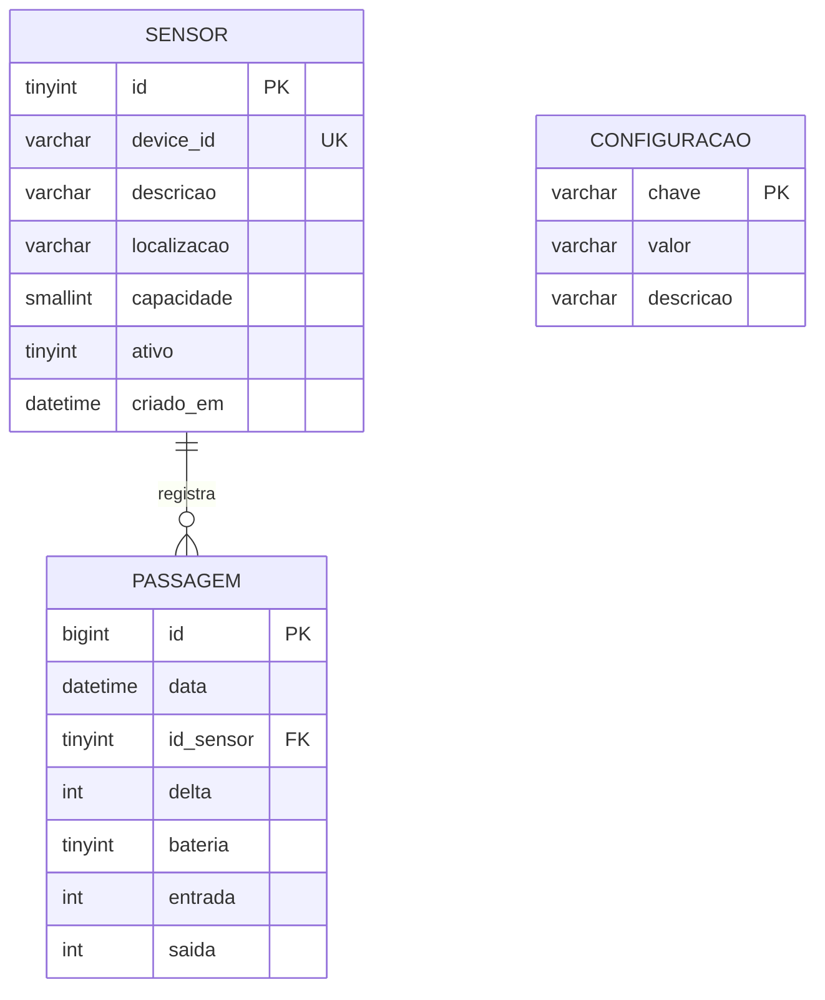
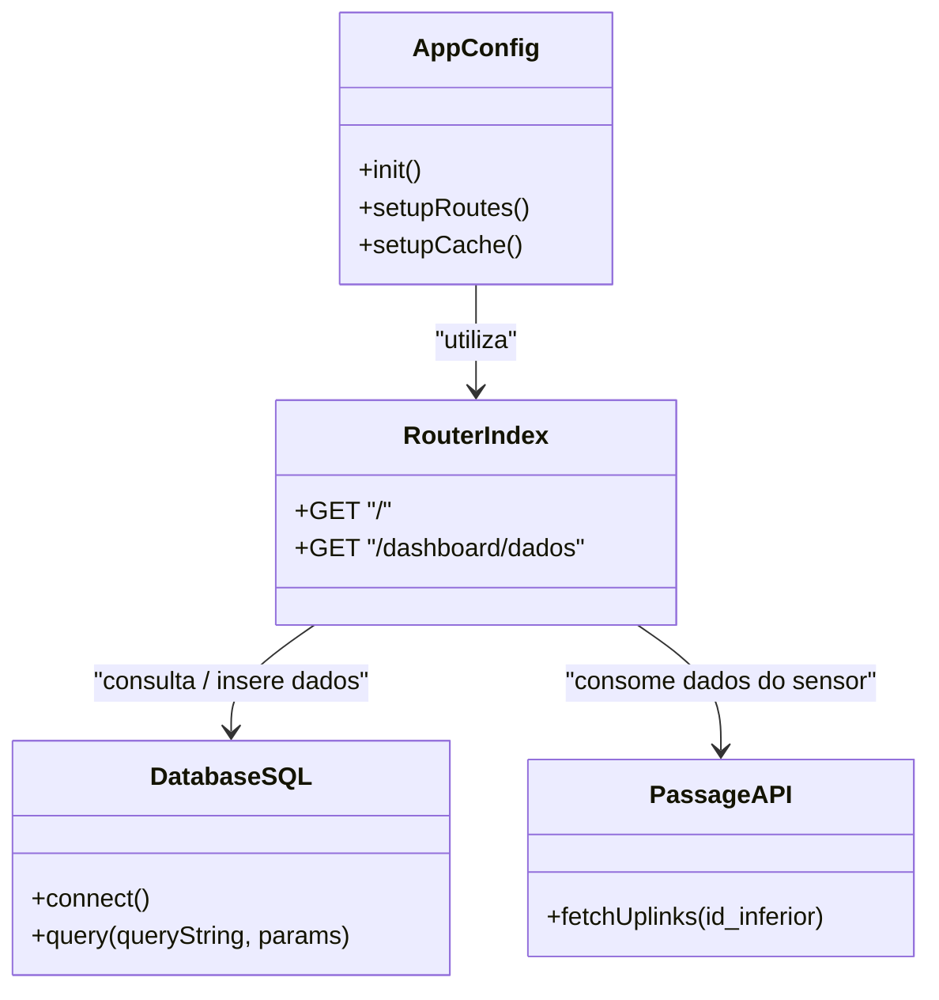

# Monitoramento Inteligente de Fluxo de Pessoas: Uma Solução IoT Baseada no Sensor VS350-B15M para Cidades Inteligentes

## 2. ANÁLISE E DESIGN

### 2.1. Requisitos Funcionais
Com base na lógica de negócio abstraída da implementação do sistema, foram mapeados os seguintes requisitos funcionais:
- **RF01:** O sistema deve registrar e contabilizar o volume de entrada e saída de pessoas por dispositivo (contagem bidirecional), salvando cada variação (delta) e medição no banco de dados.
- **RF02:** O sistema deve calcular, em tempo real, a ocupação atual de um ambiente monitorado (presentes = soma de entradas - soma de saídas).
- **RF03:** O sistema deve definir a taxa de ocupação em formato de percentual com base na capacidade máxima parametrizada para cada local.
- **RF04:** O sistema deve classificar a ocupação mediante configuração paramétrica, indicando o status "NORMAL", "ATENÇÃO" ou "CRÍTICO" (por padrão, superior a 80% e 90%, respectivamente).
- **RF05:** O sistema deve realizar chamadas para uma API externa visando a captação dos lotes de dados oriundos dos sensores IoT.
- **RF06:** O sistema deve exibir dashboards analíticos interativos contemplando distribuição de fluxo por hora, variabilidade semanal, comparativo de entradas e saídas e a tendência da ocupação em tempo real.

### 2.2. Requisitos Não Funcionais
Os requisitos não funcionais, que balizam as premissas de arquitetura e infraestrutura adotadas, englobam:
- **RNF01 (Tecnologia Back-end):** A aplicação deve ser construída na linguagem JavaScript, sobre a plataforma Node.js, utilizando o framework Express.
- **RNF02 (Banco de Dados):** O sistema deve utilizar o SGBD relacional MySQL para armazenamento estruturado de métricas e configurações.
- **RNF03 (Desempenho e Caching):** A aplicação deve apresentar alta disponibilidade e rápido tempo de resposta, utilizando uma arquitetura com cache em memória (via biblioteca LRU-Cache, com limite máximo de 200 objetos) para a renderização de views no servidor.
- **RNF04 (Privacidade de Dados):** A solução deve estar 100% aderente à Lei Geral de Proteção de Dados (LGPD), efetuando contagem numérica de eventos por meio do sensor Milesight VS350-915M, desprovida de quaisquer capturas biométricas ou fotográficas dos transeuntes.
- **RNF05 (Tecnologia Front-end):** A interface do usuário deve adotar o motor de visualização EJS (Embedded JavaScript) para Server-Side Rendering (SSR).

### 2.3. Diagramas UML

**Diagrama Relacional (MER / Modelo de Dados):**

**Diagrama de Classes (Principais Módulos do Backend):**

### 2.4. Wireframe
A interface do usuário do sistema é composta por uma aplicação *Single Page / Landing Page* modular, cujas seções e dashboards são estruturados visualmente da seguinte forma:
- **Barra de Navegação (Navbar):** Menu de acesso rápido aos setores "Sobre", "Equipe", "Dashboard" e "Dados", fixado no topo para uma navegação âncora rápida.
- **Hero Section:** Banner inicial contendo um chamado para ação ("Monitoramento Inteligente de Fluxo de Pessoas") e a proposta de valor do sistema de mitigação da superlotação sem captura de imagens.
- **Seção "Sobre" (Features):** Cards ilustrados contendo as principais especificações técnicas do sensor, as vantagens de inteligência de dados do monitoramento preditivo e o atestado de conformidade à LGPD.
- **Seção "Equipe":** Estrutura em grade contendo a foto/avatar e o nome de cada membro desenvolvedor.
- **Seção de Dashboard Analítico:** Composta por um mosaico contendo 5 quadros (canvas de gráficos) subdivididos em três linhas:
  - Linha 1: Gráfico de barras da "Distribuição de Fluxo por Hora" e gráfico de amplitude em "Variabilidade Semanal".
  - Linha 2: Gráfico de barras comparativas "Entradas vs. Saídas" e gráfico do tipo Rosca (Donut) evidenciando a "Ocupação por Setor".
  - Linha 3: Gráfico de linhas com preenchimento (ocupando a tela inteira) que elucida a "Tendência de Ocupação em Tempo Real".
  - *Interatividade:* Cada gráfico detém botões de filtro (Hoje, Semana, Mês) para refinar o escopo dos dados de requisições assíncronas enviadas à rota de monitoramento.
- **Seção de Estrutura de Dados:** Tabela exibindo um dicionário de dados focado no usuário, mapeando os campos fundamentais das medições do sensor (ID_Sensor, Timestamp, Entradas, Saídas, Ocupação Atual e Status Alerta) para facilitar a interpretação gerencial.

### 2.5. Arquitetura do Sistema
A arquitetura do sistema engloba o ciclo completo da telemetria à exibição analítica (End-to-End):
- **Integração IoT / Sensores:** Os dispositivos Passage People Counter VS350-915M ficam fixados nas entradas e saídas físicas. Estes computam o tráfego via tecnologia ToF (Time-of-Flight) e transmitem um *uplink* em formato JSON via rede LoRaWAN, fornecendo o balanço (entradas, saídas e variação – *delta*) além do status da bateria. 
- **APIs de Ingestão:** Uma API central retém momentaneamente as contagens do hardware. O backend foi projetado para consumir estes dados via `axios`, utilizando controle de cursor incremental (`id_inferior`) a fim de captar apenas novos registros e aliviar a volumetria de rede.
- **Camada de Backend (Serviço Node.js):** Arquitetura que isola responsabilidades em rotas via módulo `express.Router`. O middleware realiza conexões parametrizadas sob demanda no banco relacional por meio de transações gerando consultas agregadas complexas e processando cálculos de janelas de tempo, como a variabilidade acumulada de ocupação (`@ocupacao`).
- **Camada de Frontend (EJS e Renderização Híbrida):** Utilização da biblioteca `ejs` em união ao pacote `express-ejs-layouts` possibilita a inserção das *views* dentro de um layout padronizado. O frontend não é apenas passivo; gráficos atualizados dependem de roteamento assíncrono devolvendo arquivos estáticos unificados com arquivos JSON na rota de telemetria de visualização do dashboard.

### 2.6. Arquitetura de Dados
A modelagem de dados do sistema foi desenvolvida sobre o SGBD MySQL (via driver `mysql2`), consistindo de uma arquitetura centralizada e de alta normalização parcial voltada a *time-series*:
- O esquema (`ananditos`) engloba 3 tabelas pivotais.
- A entidade principal `passagem` comporta dados transacionais que armazenam as ocorrências geradas pelo sensor (id, data, id_sensor, delta, bateria, entrada e saida), atrelada por chave estrangeira à tabela de metadados de domínio `sensor`.
- A arquitetura dispõe as contagens brutas; a informação consolidada como "Ocupação" e os limites de lotação e classificação ("NORMAL", "ATENCAO", "CRITICO") não são salvos de forma estática, mas calculados dinamicamente em tempo de execução cruzando os *inputs* e *outputs* com a entidade de dicionário `configuracao` que parametrizou a capacidade.

## 3. DESENVOLVIMENTO

O projeto foi materializado através de um ecossistema orientado a eventos e micro-requisições (serviços web REST). O núcleo do serviço (`app.js`) foi programado de forma estruturada estabelecendo diretivas rigorosas de não retenção de cache do lado do cliente para rotas vitais do sistema (manipulação de cabeçalhos HTTP como `Pragma: no-cache` e exclusão de identificadores de entidade - ETag), assegurando que o monitoramento analítico exibisse inequivocamente os dados em tempo real.

No nível do controlador de dados (`routes/index.js`), o desenvolvimento abordou a complexidade analítica ao utilizar variáveis de escopo no ambiente SQL (ex: *cross join* com variáveis *inline* como `@ocupacao := greatest(...)`) visando processar o histórico cumulativo cronológico de entradas e subtrair as saídas a fim de derivar a presença espacial real instantaneamente durante a requisição web, sem onerar o consumo de memória do código Node.js. 

A sincronização de informações dos hardwares foi concebida por rotinas em lote, onde o controlador verifica o último registro consolidado no repositório de dados MySQL e aciona um *endpoint* GET no *gateway* de sensores passando este ID referencial. O retorno do lote abastece o repositório local.

O banco de dados da aplicação abarca estruturas condicionadas para lidar com alto fluxo e particionamento de janelas temporais de agregação por hora (`extract(hour from data)`), possibilitando criar mapas de calor (Heatmaps) e visualizações contínuas sobre o comportamento das multidões, conforme expresso na robusta estrutura contida em `script.sql`.

O código fonte de todos os artefatos se encontra integralmente disponível por intermédio do sistema de versionamento de código no repositório público do GitHub, sob a licença MIT, o qual pode ser acessado em: [https://github.com/tech-espm/inter-3sem-2026-ananditos](https://github.com/tech-espm/inter-3sem-2026-ananditos).

## 4. PLANEJAMENTO

A fim de assegurar escalabilidade das entregas e adaptações a requisitos que nasceram no decorrer da execução do projeto, adotou-se o framework de metodologias ágeis SCRUM. 

- **Distribuição dos Papéis (Scrum Team):**
  - **Product Owner (PO):** Betina Volpi Nazário (responsável pelo levantamento da lógica de negócios voltada ao cenário da CPTM, garantia da aderência à LGPD e avaliação contínua do valor do produto na ótica das Smart Cities).
  - **Scrum Master:** Rodrigo Naohan Rodrigues Neiland (responsável por mitigar entraves técnicos, facilitar as cerimônias da equipe e monitorar a saúde do processo ágil).
  - **Equipe de Desenvolvimento (Dev Team):** Kayla Santos Abreu, Ícaro Dias Marculino, Betina Volpi Nazário e Rodrigo Naohan Rodrigues Neiland (responsáveis pela modelagem das bases de dados, rotinas de requisição em backend, estruturação dos algoritmos e materialização dos layouts em frontend).

- **Estruturação do Processo e Sprints:**
  O projeto foi fragmentado em Sprints de cadência fixa com duração de 2 semanas cada, balanceando estabilidade no compromisso com flexibilidade. Os artefatos de controle das tarefas (Product Backlog e Sprint Backlog) foram geridos integralmente em plataforma de acompanhamento Kanban (Trello), em conciliação estrita com a revisão de versão gerenciada nos *branches* do repositório no GitHub.

- **Cerimônias:**
  - *Sprint Planning:* Realizadas no início de cada ciclo visando a estimativa de esforço e elucidação das prioridades arquiteturais, definindo metas claras como a concepção do modelo SQL e a integração com a API.
  - *Daily Scrum:* Acompanhamentos operacionais breves (diários) para rastreabilidade do avanço de cada membro, detectando e sanando intercorrências em tempo hábil.
  - *Sprint Review e Retrospectiva:* No término de cada sprint, conduziu-se a validação das entregas com demonstração dos dados reais dos sensores operando nos dashboards dinâmicos, atrelada à autoanálise crítica para iterar melhorias contínuas no fluxo comunicacional e produtivo da equipe.

## 5. CONCLUSÕES

Diante do advento das Cidades Inteligentes (Smart Cities), o emprego da internet das coisas (IoT) desatrelada do sensoriamento biométrico demonstrou ser uma prerrogativa plausível e eficiente, corroborando que é viável maximizar a utilidade pública e a gestão de multidões sem onerar o direito à privacidade assegurado pela LGPD. O presente trabalho atestou a exequibilidade prática do modelo ao monitorar o fluxo humano em potenciais infraestruturas, como estações da CPTM, dotando-as de alta fidelidade analítica.

Sob a perspectiva dos resultados técnicos, os algoritmos e a modelagem do banco de dados relacional ratificaram a competência da pilha de tecnologias Node.js e MySQL na orquestração e consolidação massiva de *time-series* de *uplinks* LoraWAN oriundos dos sensores VS350. Alcançou-se, com êxito, a entrega de um painel web responsivo, calcado em agregação de matrizes contínuas que exibem a ocupação espacial em tempo real, delimitam os picos horários de densidade humana por meio do processamento avançado de cálculos estocásticos (*cross joins* de ocupação cumulativa) e antecipam cenários críticos por níveis paramétricos de lotação que disparam alertas automatizados na interface visual. A infraestrutura implementada sedimenta uma robusta plataforma analítica dotada de inteligência de dados aplicada que instrumentalizará de maneira estratégica os tomadores de decisão urbanos na operação de rotas e segurança.

## 6. REFERÊNCIAS BIBLIOGRÁFICAS

BRASIL. *Lei nº 13.709, de 14 de agosto de 2018. Lei Geral de Proteção de Dados Pessoais (LGPD)*. Diário Oficial da União: seção 1, Brasília, DF, ano 155, n. 157, p. 59-64, 15 ago. 2018.

EXPRESS. *Express: Fast, unopinionated, minimalist web framework for Node.js*. [S. l.]: Node.js Foundation, 2026. Disponível em: <https://expressjs.com/>. Acesso em: 18 maio 2026.

MILESIGHT. *VS350 Passage People Counter: User Guide*. Xiamen, China: Milesight IoT, 2024. Disponível em: <https://www.milesight-iot.com/>. Acesso em: 18 maio 2026.

MYSQL. *MySQL 8.0 Reference Manual*. Oracle Corporation, 2026. Disponível em: <https://dev.mysql.com/doc/refman/8.0/en/>. Acesso em: 18 maio 2026.

NODE.JS. *Node.js Documentation*. [S. l.]: OpenJS Foundation, 2026. Disponível em: <https://nodejs.org/en/docs/>. Acesso em: 18 maio 2026.
